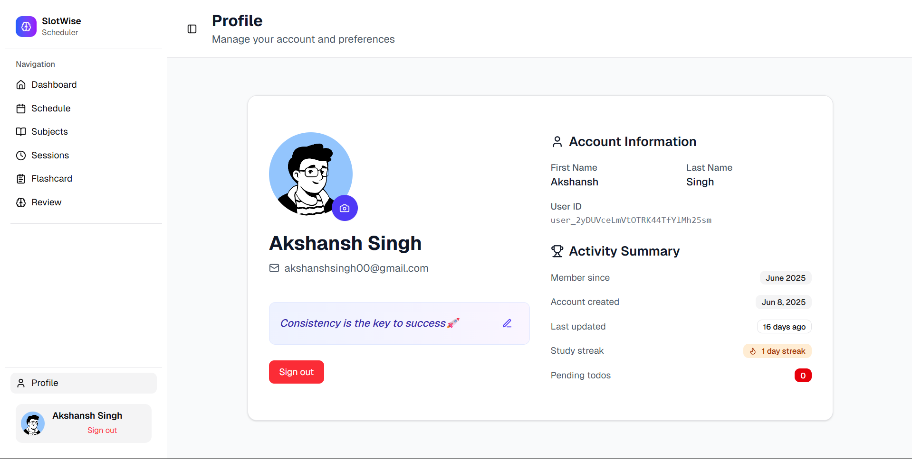

# Study Scheduler

Study Scheduler is a modern study scheduling and review application that helps students plan, track, and review their study sessions with spaced-repetition flashcards, smart scheduling and progress analytics. Built with the modern T3-Stack (Next.js App Router + tRPC + Prisma), it delivers an end-to-end type-safe developer experience and a smooth, responsive UI.

## 

## Tech Stack

- 
- 
- 
- 
- 
- [](https://www.postgresql.org/)
- 
- 

---

## Features

- **Subject management**: Create and manage all subject and organize different sessions and reviews according to your subjects.
- **Session Scheduling**: Create and manage study sessions with a rich calendar view.
- **Flashcards**: Organize and review flashcards by subject.
- **Progress Tracking**: Log session durations and view stats over time.
- **User Profiles**: Sign up, sign in, and manage your profile securely with Clerk.

---

## Screenshots

- Dashboard
  

- Schedule page
  

- Subjects page
  

- Sessions page
  

- Ongoing session
  

- Review page
  

- Profile page
  

---

## Usage

1. **Clone the repo**

   ```bash
   git clone https://github.com/akshansh029/study-scheduler.git
   cd study-scheduler
   ```

2. **Install dependencies**

   ```bash
   npm install
   ```

3. **Configure environment variables**
   Create a .env.local file in the project root with the variables listed below.

4. **Run database migrations & generate client**

   ```bash
   npm run db:generate
   ```

5. **Start the development server**

   ```bash
   npm run dev
   ```

6. **Build & preview**
   ```bash
   npm run build
   npm run preview
   ```

## Project Structure

```
├── .vscode
├── hooks
├── node_modules
│   └── prisma
│       └── engines
├── prisma
├── public
├── scripts
└── src
    ├── app
    │   ├── (protected)
    │   │   └── dashboard
    │   │       ├── flashcards
    │   │       ├── profile
    │   │       ├── review
    │   │       │   └── [subjectId]
    │   │       ├── schedule
    │   │       ├── sessions
    │   │       │   └── [sessionId]
    │   │       └── subjects
    │   ├── api
    │   │   ├── cron
    │   │   │   └── reset-sessions
    │   │   └── trpc
    │   │       └── [trpc]
    │   └── sync-user
    ├── components
    │   └── ui
    ├── hooks
    ├── lib
    ├── server
    │   └── api
    │       └── routers
    ├── styles
    ├── trpc
    └── utils
```

## Environment Variables

```
DATABASE_URL="postgresql-database-url"
NEXT_PUBLIC_CLERK_PUBLISHABLE_KEY="your-clerk-publishable-key"
CLERK_SECRET_KEY="your-clerk-secret-key"
NEXT_PUBLIC_CLERK_SIGN_IN_FALLBACK_REDIRECT_URL='/'
NEXT_PUBLIC_CLERK_SIGN_UP_FALLBACK_REDIRECT_URL='/'
NEXT_PUBLIC_CLERK_SIGN_UP_FORCE_REDIRECT_URL='/sync-user'
NEXT_PUBLIC_CLERK_SIGN_IN_FORCE_REDIRECT_URL='/dashboard'
CRON_SECRET="random-hex-code"
```

> Note: Create a Clerk application at Clerk Dashboard to obtain your keys.

## Contributing

1. Fork the repository

2. Create a feature branch (git checkout -b feat/YourFeature)

3. Commit your changes (git commit -m 'Add some feature')

4. Push to your branch (git push origin feat/YourFeature)

5. Open a Pull Request detailing your changes

Please adhere to the existing code style and include tests where applicable.
